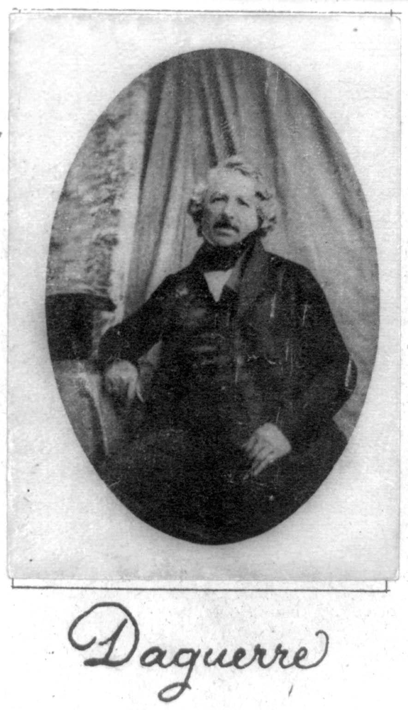

Django Daguerre
===============

   
   Louis Daguerre, Father of Photography

**Django Daguerre** provides sophisticated models and template tags for
managing, cropping, and scaling images. It can be used for generating
thumbnails as well as for processing images in more complex ways.

Contents
--------

.. toctree::
   :maxdepth: 2

   getting-started
   template-tags
   adjustments
   project

Indices and tables
------------------

* :ref:`genindex`
* :ref:`modindex`
* :ref:`search`

